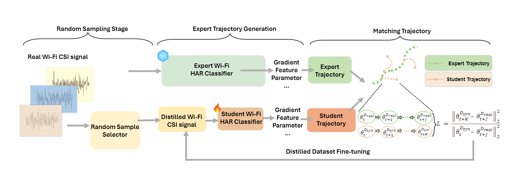

# WiDistill
Official implementation of ''WiDistill: Distilling Large-scale Wi-Fi Datasets with Matching Trajectory''

WiDistill: Distilling Large-scale Wi-Fi Datasets with Matching Trajectory

Tiantian Wang,  [Fei Wang](https://scholar.google.com/citations?user=LKPpmXQAAAAJ&hl=en) 

Xi'an Jiaotong University

The task of "WiDistill" is to reduce the size of a large Wi-Fi dataset using trajectory matching-based distillation, creating a much smaller dataset that maintains similar performance to the original.



# Getting Started
First, download our repo:
```python
git clone https://github.com/the-sky001/WiDistill.git
cd WiDistill
```

For an express instillation, we include .yaml files.
```python
conda env create -f environment.yaml
 ```

You can then activate your conda environment with
```python
conda activate widistill
 ```

# Generating Expert Trajectories
Before doing any distillation, you'll need to generate some expert trajectories using buffer.py

* For XRF55
```python
python buffer.py --dataset=xrf55 --model=xrf_resnet18   --save_interval 1 --lr_teacher 0.01 --train_epochs=150 --num_experts=10 --buffer_path=/home/xxx/buffer/ --data_path=/home/xxx/xrf/new_data/
 ```

* For Widar3.0
```python
python buffer.py --dataset=widar --model=widar_mlp  --save_interval 1 --lr_teacher 0.01 --train_epochs=200 --num_experts=10 --buffer_path=/home/xxx/buffer --data_path=/home/xxx/Widardata2
 ```


* For MM-Fi
```python
python buffer.py --dataset=mmfi --model=mmfi_resnet18 --save_interval 1 --lr_teacher 0.1 --train_epochs=150 --num_experts=2 --buffer_path=/home/xxx/buffer/  --data_path=/home/xxx/mmfi
 ```
The running code of the machine learning method is similar to that under the same dataset, just replace the program with the corresponding code, e.g.:
```python
python baseline_herding.py --dataset=xrf55  --buffer_path=/home/xxx/buffer --data_path=/home/xxx/xrf/new_data/
 ```

# Distillation by Matching Training Trajectories
The following command will then use the buffers we just generated to distill.
* For Widar3.0
```python
python distill.py --dataset=widar --ipc=50 --syn_steps=50 --expert_epochs=2 --max_start_epoch=10 --dsa=True --load_all --lr_img=10 --batch_syn=2000 --lr_lr=1e-07 --model=widar_mlp --lr_teacher=0.01 --buffer_path=/home/xxx/result --data_path=/home/xxx/Widardata2
 ```
* For XRF55
```python
python distill.py --dataset=xrf55 --ipc=50 --syn_steps=2 --expert_epochs=2 --max_start_epoch=15 --lr_img=100 --lr_lr=1e-05 --model=xrf_resnet18 --lr_teacher=0.1 --batch_syn=20 --buffer_path=/home/xxx/buffer --data_path=/home/xxx/xrf/new_data/
 ```
  
* For MM-Fi
```python
python distill.py --dataset=mmfi --ipc=50 --syn_steps=10 --expert_epochs=2 --max_start_epoch=15   --lr_img=1000 --lr_lr=1e-05 --model=mmfi_resnet18 --lr_teacher=0.01 --buffer_path=/home/xxx/ --data_path=/home/xxx/mmfi_new2
 ```


# Evaluation

* For Widar3.0
```python
python evaluation.py --dataset=widar --model=widar_mlp --data_dir=/home/xxx/images_best.pt --label_dir=/home/xxx/labels_best.pt
 ```

* For XRF55
```python
python evaluation.py --dataset=xrf55 --model=xrf_resnet18 --data_dir=/home/xxx/images_best.pt --label_dir=/home/xxx/labels_best.pt
 ```
  
* For MM-Fi
```python
python evaluation.py --dataset=mmfi --model=mmfi_resnet18 --data_dir=/home/xxx/images_best.pt --label_dir=/home/xxx/labels_best.pt
 ```

The running code of the machine learning method is similar to that under the same dataset, just replace the program with the corresponding code, e.g.:
```python
python evaluation.py --dataset=widar --model=widar_mlp --data_dir=/home/xxx/selected_features_ipc50.pt --label_dir=/home/xxx/selected_labels_ipc50.pt 
 ```


# Acknowledgement

Our work is implemented base on the following projects. We really appreciate their excellent open-source works!

[mtt-distillation](https://github.com/GeorgeCazenavette/mtt-distillation) [related paper](https://arxiv.org/abs/2203.11932)


