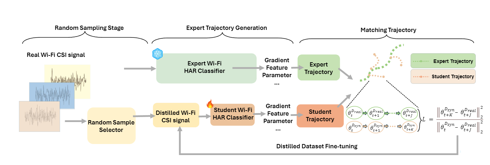
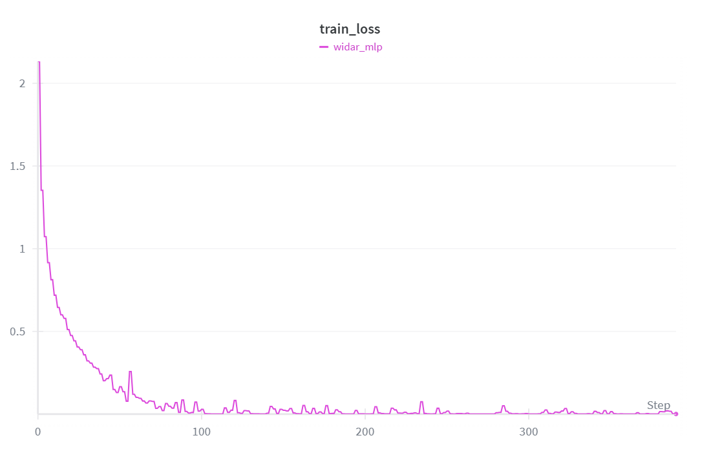
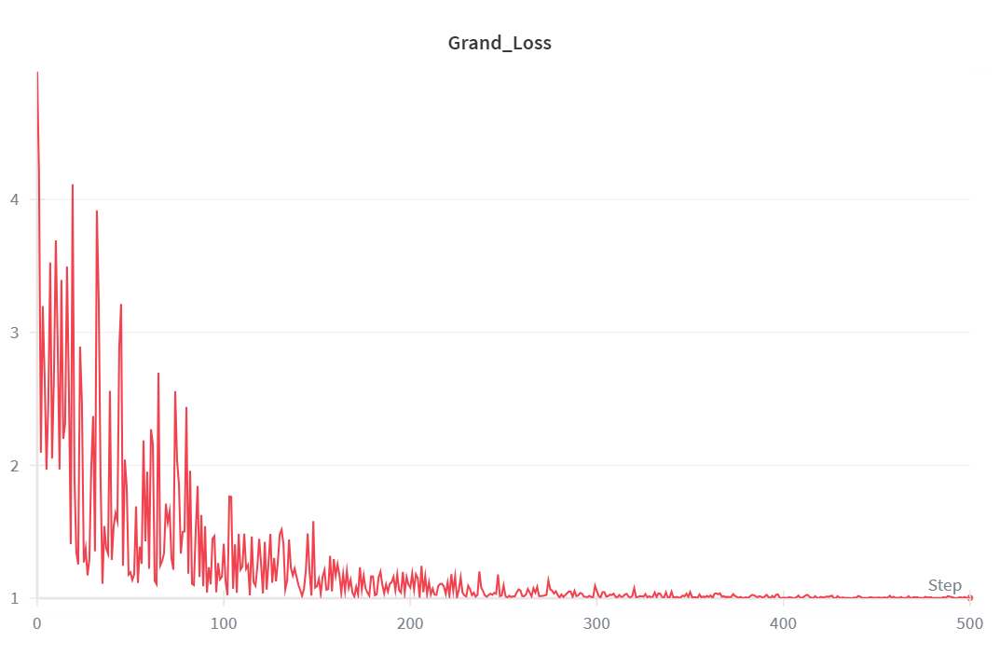
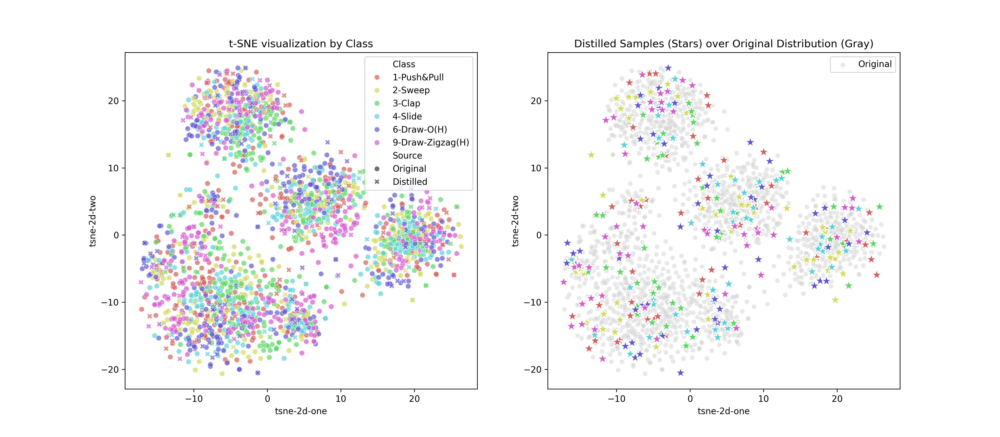

# WiDistill
Official implementation of ''WiDistill: Distilling Large-scale Wi-Fi Datasets with Matching Trajectory''

WiDistill: Distilling Large-scale Wi-Fi Datasets with Matching Trajectory

Tiantian Wang,  [Fei Wang](https://scholar.google.com/citations?user=LKPpmXQAAAAJ&hl=en) 

Xi'an Jiaotong University

The task of "WiDistill" is to reduce the size of a large Wi-Fi dataset using trajectory matching-based distillation, creating a much smaller dataset that maintains similar performance to the original.



# Getting Started
First, download our repo:
```python
git clone https://github.com/the-sky001/WiDistill.git
cd WiDistill
```

For an express instillation, we include .yaml files.
```python
conda env create -f environment.yaml
 ```

You can then activate your conda environment with
```python
conda activate widistill
 ```

# Generating Expert Trajectories
Before doing any distillation, you'll need to generate some expert trajectories using buffer.py

* For XRF55
```python
python buffer.py --dataset=xrf55 --model=xrf_resnet18   --save_interval 1 --lr_teacher 0.01 --train_epochs=150 --num_experts=10 --buffer_path=/home/xxx/buffer/ --data_path=/home/xxx/xrf/new_data/
 ```

* For Widar3.0
```python
python buffer.py --dataset=widar --model=widar_mlp  --save_interval 1 --lr_teacher 0.01 --train_epochs=200 --num_experts=10 --buffer_path=/home/xxx/buffer --data_path=/home/xxx/Widardata2
 ```


* For MM-Fi
```python
python buffer.py --dataset=mmfi --model=mmfi_resnet18 --save_interval 1 --lr_teacher 0.1 --train_epochs=150 --num_experts=2 --buffer_path=/home/xxx/buffer/  --data_path=/home/xxx/mmfi
 ```
The running code of the machine learning method is similar to that under the same dataset, just replace the program with the corresponding code, e.g.:
```python
python baseline_herding.py --dataset=xrf55  --buffer_path=/home/xxx/buffer --data_path=/home/xxx/xrf/new_data/
 ```

# Distillation by Matching Training Trajectories
The following command will then use the buffers we just generated to distill.
* For Widar3.0
```python
python distill.py --dataset=widar --ipc=50 --syn_steps=50 --expert_epochs=2 --max_start_epoch=10 --dsa=True --load_all --lr_img=10 --batch_syn=2000 --lr_lr=1e-07 --model=widar_mlp --lr_teacher=0.01 --buffer_path=/home/xxx/result --data_path=/home/xxx/Widardata2
 ```
* For XRF55
```python
python distill.py --dataset=xrf55 --ipc=50 --syn_steps=2 --expert_epochs=2 --max_start_epoch=15 --lr_img=100 --lr_lr=1e-05 --model=xrf_resnet18 --lr_teacher=0.1 --batch_syn=20 --buffer_path=/home/xxx/buffer --data_path=/home/xxx/xrf/new_data/
 ```
  
* For MM-Fi
```python
python distill.py --dataset=mmfi --ipc=50 --syn_steps=10 --expert_epochs=2 --max_start_epoch=15   --lr_img=1000 --lr_lr=1e-05 --model=mmfi_resnet18 --lr_teacher=0.01 --buffer_path=/home/xxx/ --data_path=/home/xxx/mmfi_new2
 ```


# Evaluation

* For Widar3.0
```python
python evaluation.py --dataset=widar --model=widar_mlp --data_dir=/home/xxx/images_best.pt --label_dir=/home/xxx/labels_best.pt
 ```

* For XRF55
```python
python evaluation.py --dataset=xrf55 --model=xrf_resnet18 --data_dir=/home/xxx/images_best.pt --label_dir=/home/xxx/labels_best.pt
 ```
  
* For MM-Fi
```python
python evaluation.py --dataset=mmfi --model=mmfi_resnet18 --data_dir=/home/xxx/images_best.pt --label_dir=/home/xxx/labels_best.pt
 ```

The running code of the machine learning method is similar to that under the same dataset, just replace the program with the corresponding code, e.g.:
```python
python evaluation.py --dataset=widar --model=widar_mlp --data_dir=/home/xxx/selected_features_ipc50.pt --label_dir=/home/xxx/selected_labels_ipc50.pt 
 ```

## Updates 
We provide additional artifacts for reproducibility:
- Loss curves: trajectory matching loss, student training loss

  trajectory matching loss:
  
  student training loss:
  
  

We visualize the feature distribution comparison using t-SNE to demonstrate that the distilled data faithfully mimics the original distribution.


*(Figure: t-SNE visualization of original vs. distilled features. The distilled samples (stars) effectively cover the distribution manifold of the original dataset (gray dots), capturing both class centers and boundary features.)*

- Sensitivity summaries for J/K/α, preprocessing switches, matching horizon 
## Sensitivity Summaries (Widar3.0, IPC=50)

We conducted an ablation study on Widar3.0 (IPC=50) to evaluate the sensitivity of key hyperparameters: synthetic learning rate (alpha), expert matching epochs (J), and matching horizon (start epoch).

### 1) Synthetic Learning Rate (alpha)

**Control:** `syn_steps=30`, `expert_epochs=2`, `start_epoch=10`

| alpha (lr_img) | Max Accuracy | Stability | Notes |
|---:|---:|:---:|---|
| 10 | 56.37% | Stable | Underfitting (too slow to converge). |
| 100 (baseline) | ~60.00% | Stable | Best trade-off between speed and stability. |
| 1000 | 62.07% | Unstable | High peak but drops (~43% at the end). |

### 2) Expert Matching Epochs (J)

| Expert Epochs (J) | Max Accuracy | Relative Improv. | Observation |
|---:|---:|---:|---|
| 1 | ~57.14% | -2.86% | Short-sighted: fails to capture long-term trajectory trends. |
| 2 (Baseline) | ~60.00% | — | Standard setting. |
| 3 | 64.45% | +4.45% | Significant gain: captures longer-term dependencies. |


### 3) Matching Horizon (Start Epoch)

**Control:** `lr_img=100`, `syn_steps=30`, `expert_epochs=2`

| Start Epoch | Stage | Max Accuracy | Notes |
|---:|---|---:|---|
| 10 | Early | ~60.00% | Informative gradients. |
| 50 | Middle | 17.18% (loss=NaN) | Failure: gradients too small / unstable. |
| 100 | Late | 17.18% (loss=NaN) | Failure: vanishing gradients. |

**Recommended default:** `alpha=100`, `J=3`, `start_epoch=10`


# Acknowledgement

Our work is implemented base on the following projects. We really appreciate their excellent open-source works!

[mtt-distillation](https://github.com/GeorgeCazenavette/mtt-distillation) [related paper](https://arxiv.org/abs/2203.11932)


